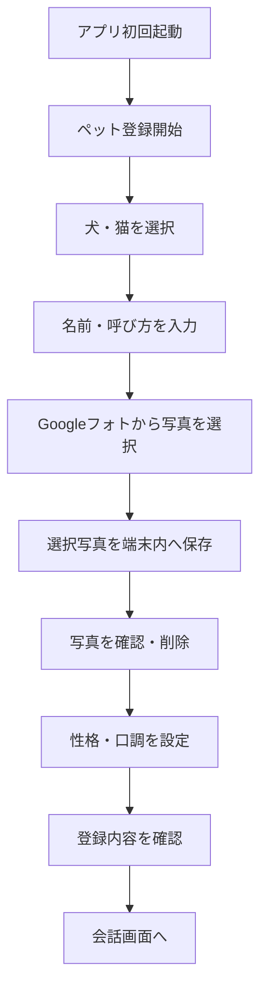

# ペット会話アプリ 実装仕様書

## 1. 目的

飼い主が登録した犬・猫の写真を会話相手のアイコンとして使用し、LINEのような画面で簡易的に会話できるAndroidアプリを作成する。

ユーザーの入力に対して、犬または猫らしい短い返信を表示する。専門的・複雑な質問には回答せず、あくまで癒やし目的のペット会話として動作させる。

## 2. 初期版の設計方針

- 対象プラットフォームはAndroid
- 初期版はペット1匹のみ登録可能
- 対応する種類は犬・猫
- 初回設定時にGoogle Photos Pickerから写真を複数選択する
- Googleフォトの「犬」「猫」自動分類結果をAPIで直接取得する仕様にはしない
- 選択した写真は端末内のアプリ専用領域へ保存する
- 会話履歴・設定・写真情報は端末内に保存する
- ログイン、クラウド同期、広告、月額課金は初期版では実装しない
- 返信は短文中心とし、AIに自由な長文回答をさせない
- 可能な返信は端末内テンプレートで処理し、判定できない入力だけAI処理する

## 3. 初期版の画面一覧

1. 起動画面
2. ペット登録開始画面
3. ペット種類選択画面
4. ペット情報入力画面
5. Googleフォト写真選択画面への遷移
6. 選択写真確認画面
7. 性格・口調設定画面
8. 登録内容確認画面
9. メイン会話画面
10. ペット設定画面

## 4. 初回設定フロー



### 4.1 ペット登録開始画面

表示項目：

- アプリタイトル
- 説明文「うちの子とお話ししてみよう」
- 「うちの子を登録する」ボタン
- 「あとで設定する」ボタン

「あとで設定する」を選んだ場合は、サンプル画像とデフォルト設定で会話画面を表示する。

### 4.2 ペット種類選択画面

選択肢：

- 犬
- 猫

必須入力とする。

### 4.3 ペット情報入力画面

入力項目：

| 項目 | 必須 | 初期値・補足 |
|---|---:|---|
| ペット名 | 任意 | 未入力時は「うちの子」 |
| 飼い主の呼び方 | 任意 | 未入力時は「きみ」 |
| ペットからの一人称 | 任意 | 犬は「ぼく」、猫は「わたし」 |

### 4.4 Googleフォト写真選択

ボタン名：

> Googleフォトから写真を選ぶ

処理要件：

1. Google Photos Picker APIを起動する
2. ユーザーに写真を複数選択させる
3. 選択結果のメディア情報を取得する
4. 写真データを端末内のアプリ専用領域へコピーする
5. アプリ内のペット写真一覧へ登録する

選択枚数：

- 最低3枚を推奨
- 1枚でも登録可能
- 上限は初期版では50枚

写真が0枚の場合は、再選択を促す。Pickerで選択された写真以外をGoogleフォトから自動取得してはならない。

Googleフォトの認証やPicker処理は、アプリからGoogleアカウントのパスワードを取得せず、公式OAuth・Pickerフローを利用する。

### 4.5 写真確認画面

機能：

- 選択写真のグリッド表示
- 写真の削除
- 写真の追加
- メイン写真の設定
- 「次へ」ボタン

最低1枚は残す。全削除時は「写真を1枚以上登録してください」と表示する。

写真はアプリ内で表示できるよう、取得後に端末内へ保存する。Googleフォトの一時URLをそのまま永続保存しない。

### 4.6 性格・口調設定画面

犬の性格候補：

- 元気
- 甘えん坊
- おっとり
- 食いしん坊
- 寂しがり

猫の性格候補：

- ツンデレ
- 甘えん坊
- マイペース
- クール
- 食いしん坊

共通設定：

- 返信の長さ：短い／普通
- 絵文字：使用する／使用しない
- 飼い主の呼び方
- 一人称

初期値：

- 返信の長さ：短い
- 絵文字：使用する
- 犬の一人称：ぼく
- 猫の一人称：わたし

### 4.7 登録内容確認画面

以下を表示する：

- メイン写真
- ペット名
- 犬／猫
- 性格
- 口調設定
- 飼い主の呼び方

ボタン：

- 「この設定で始める」
- 「戻る」

登録完了後、メイン会話画面へ遷移する。

## 5. 会話画面仕様

### 5.1 レイアウト

- 上部：ペット名、設定ボタン
- 中央：メッセージ一覧
- 下部：入力欄、送信ボタン
- ユーザーのメッセージは右側
- ペットのメッセージは左側
- ペットの返信には登録写真の丸型アイコンを表示

### 5.2 送信処理

1. 入力欄が空でないことを確認する
2. ユーザーメッセージを保存・表示する
3. 入力文をカテゴリ分類する
4. テンプレート返信が利用できる場合はテンプレートを選ぶ
5. 利用できない場合だけAI返信を実行する
6. 返信に使用する写真を選ぶ
7. ペットの返信を表示する
8. 会話履歴を端末内に保存する

送信中は二重送信を防止する。

### 5.3 写真選択ルール

- ペット写真からランダムに1枚選択する
- 直前と同じ写真は可能な限り避ける
- 写真が1枚の場合は同じ写真を使用する
- 写真読み込み失敗時はメイン写真を使用する
- 初期版は完全ランダムとする

将来、会話内容に応じた写真カテゴリ選択を追加する。

## 6. 返信仕様

### 6.1 返信制約

- 原則1〜2文
- 原則40文字以内
- 犬・猫らしい短い表現にする
- 人間の専門家のように回答しない
- 医療・法律・金融・仕事の判断を断定しない
- 難しい質問には「わからない」「むずかしいことはわからない」と返す
- 不安を煽る表現、攻撃的表現、極端な表現は禁止
- ペットが万能な知識を持つような発言は禁止

### 6.2 入力カテゴリ

- 挨拶
- 疲れた・休みたい
- 寂しい・不安
- 食事
- 遊び
- 外出・帰宅
- 睡眠
- 仕事
- 体調不良
- 褒める・好き
- 専門的な質問
- 判定不能

### 6.3 返信例

| 入力カテゴリ | 犬の例 | 猫の例 |
|---|---|---|
| 疲れた | おつかれさま。そばにいるよ | ゆっくり休みなよ |
| 寂しい | ぼくがいるよ！ | そばにいてあげてもいいよ |
| 食事 | ご飯？おやつもほしい！ | おいしいものなら食べる |
| 遊び | 遊ぼう！ | 気が向いたら遊ぶね |
| 帰宅 | おかえり！待ってたよ | 遅かったね。おかえり |
| 体調不良 | ちゃんと休んでね | 無理しないでね |
| 専門質問 | むずかしいことはわからないよ | それは人間に聞いてみて |
| 判定不能 | そうなんだね。なでて？ | ふーん。そばにいるよ |

## 7. AI処理仕様

### 7.1 処理方針

端末内判定を優先し、AI呼び出し回数を抑える。

- 定型カテゴリに該当する入力：テンプレート返信
- 定型カテゴリに該当しない入力：AI返信
- AI失敗時：端末内フォールバック返信
- AI返信は会話履歴を必要最小限だけ送る

### 7.2 AIプロンプト要件

AIには少なくとも以下を渡す：

- 種類：犬または猫
- ペット名
- 性格
- 一人称
- 飼い主の呼び方
- 返信長さ
- 絵文字設定
- ユーザーの最新メッセージ

AIへの指示内容：

```text
あなたはユーザーが飼っている犬または猫です。
人間の専門家ではありません。
飼い主に寄り添う、短く自然なペットらしい返事をしてください。
返答は原則40文字以内、1〜2文にしてください。
難しい質問、医療、法律、金融、仕事の判断には断定的に答えず、
「むずかしいことはわからないよ」など、ペットらしく返してください。
犬や猫が実際にできない高度な知識を持つような回答は禁止です。
```

### 7.3 AI失敗時の処理

AIエラー、通信エラー、タイムアウト時は、次のいずれかを表示する：

- うまく言えないけど、そばにいるよ
- それはむずかしいなあ
- 今日はゆっくりしよ？

エラー内容やAPIキーを画面に表示しない。

## 8. データモデル案

### PetProfile

```kotlin
data class PetProfile(
    val id: String,
    val name: String,
    val species: PetSpecies,
    val personality: Personality,
    val ownerCallName: String,
    val firstPerson: String,
    val replyLength: ReplyLength,
    val useEmoji: Boolean,
    val mainPhotoId: String?,
    val createdAt: Long,
    val updatedAt: Long
)
```

### PetPhoto

```kotlin
data class PetPhoto(
    val id: String,
    val petId: String,
    val localPath: String,
    val source: PhotoSource,
    val googleMediaItemId: String?,
    val isMain: Boolean,
    val createdAt: Long
)
```

### ChatMessage

```kotlin
data class ChatMessage(
    val id: String,
    val petId: String,
    val sender: Sender,
    val text: String,
    val photoId: String?,
    val category: MessageCategory?,
    val replySource: ReplySource?,
    val createdAt: Long
)
```

`replySource`には、`TEMPLATE`、`AI`、`FALLBACK`のいずれかを保存する。

## 9. Googleフォト連携実装指示

- Google Photos Picker APIを使用する
- Googleフォトの全ライブラリを自動走査しない
- ユーザーがPickerで選択したメディアだけを取得する
- 取得した画像を端末内へ保存する
- Googleフォトの一時的なbase URLを永続的な画像URLとして保存しない
- Googleアカウントのパスワードをアプリで扱わない
- 権限要求前に、写真をペットアイコンとして利用することを説明する
- 写真選択をキャンセルした場合は、エラーではなく前画面へ戻す
- 写真取得に失敗した場合は再試行ボタンを表示する

## 10. 設定画面

会話画面の設定ボタンから以下を変更できる：

- ペット名
- 性格
- 飼い主の呼び方
- 一人称
- 返信の長さ
- 絵文字設定
- 写真の追加・削除
- メイン写真変更
- 会話履歴削除
- ペット情報の初期化

「ペット情報の初期化」は確認ダイアログを表示する。

## 11. 初期版で実装しないもの

- Googleフォトの自動分類結果の完全自動取得
- 複数ペットの同時登録
- 音声入力
- ペット音声の読み上げ
- 写真の自動表情分析
- SNS共有
- クラウドバックアップ
- Web版との同期
- ペットの健康診断・病気判定
- 本物の犬猫の発言を正確に翻訳する機能

## 12. 実装順序

### PR1：画面とローカルデータ基盤

- 初回設定画面を作成
- ペット情報を端末内に保存
- 会話画面の基本レイアウトを作成
- メッセージを端末内に保存

### PR2：写真登録

- Google Photos Picker連携
- 写真の端末内保存
- 写真確認・削除
- メイン写真設定
- 会話アイコンのランダム表示

### PR3：テンプレート返信

- 入力カテゴリ分類
- 犬・猫別の返信テンプレート
- 性格による返信候補の切り替え
- 返信文字数制限

### PR4：AI返信

- 判定不能入力だけAIへ送信
- AIプロンプト実装
- AIエラー時のフォールバック
- AI利用ログの保存
- 1日あたりの利用回数制限

### PR5：設定・品質改善

- ペット情報編集
- 写真追加・削除
- 会話履歴削除
- 初回設定の再実行
- 空入力・連続送信・通信エラー対策

## 13. 受け入れ条件

- 初回起動時に犬または猫を登録できる
- GoogleフォトPickerから複数写真を選択できる
- 選択写真が端末内に保存される
- 登録写真が会話画面のペットアイコンに表示される
- 返信ごとに写真がランダムに切り替わる
- 直前と同じ写真が連続しにくい
- 会話履歴をアプリ再起動後も表示できる
- 犬と猫で返信内容の傾向が変わる
- 性格設定が返信に反映される
- 40文字を超える返信が通常表示されない
- 専門的な質問に断定回答しない
- AIが使えない場合もフォールバック返信が表示される
- 写真取得キャンセル時にアプリが異常終了しない
- 写真権限やGoogle認証の理由がユーザーに分かる
- ペット情報と会話履歴をユーザー操作で削除できる

## 14. 実装時の注意

- Googleフォト連携は、ユーザーが選択した写真だけを対象にする
- ペットの健康・病気・薬・投資・法律などの回答は、アプリの目的外として制限する
- AIが人間のような長文回答をした場合は、アプリ側でも文字数制限・整形を行う
- AI返信を完全に信頼せず、定型文とフォールバックを必ず用意する
- 写真データは端末内に保存し、不要になった場合に削除できるようにする
- 将来的な複数ペット対応を考慮し、PetProfileにIDを持たせる
- AI利用料金を確認できるよう、返信元と利用回数をログに残す

